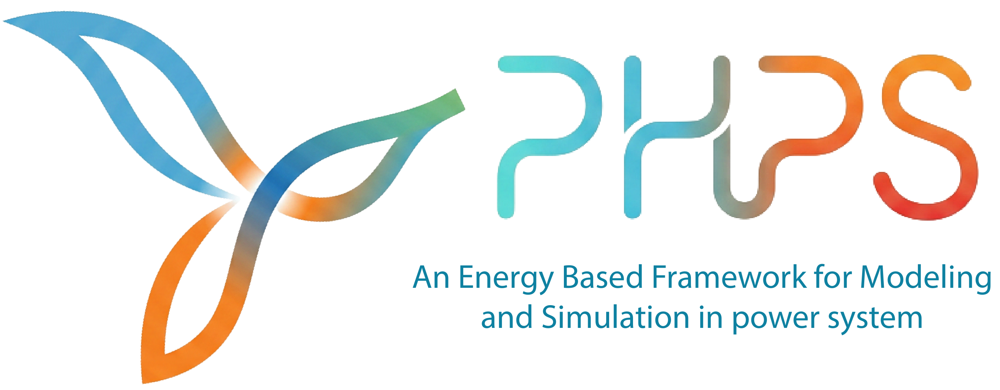

<table>
<tr>
<td valign="middle"></td>
<td valign="middle">
<h1>PHPS — Port-Hamiltonian Power System Simulator</h1>
<p><em>A compiled power system transient stability simulator — JSON to native C++ DAE in one command.</em></p>
</td>
</tr>
</table>

[](https://www.python.org/)
[](https://isocpp.org/)
[](https://computing.llnl.gov/projects/sundials)
[](LICENSE)
[]()

---

## What Is PHPS?

PHPS is a power system transient stability simulator that compiles JSON network descriptions into native C++ solvers. It encodes network topology, component physics, and control wiring into a single differential-algebraic equation (DAE) system and solves it with the SUNDIALS IDA variable-order BDF integrator at native speed — no Python overhead during the actual simulation.

Every grid component , like synchronous machine, exciter, governor and renewable inverter is a self-contained Python class that declares its own states, ports, parameters, and C++ dynamics. The framework provides six integration backends across four execution tiers: interpreted Python, SciPy Radau, Numba JIT-compiled, and fully compiled C++. The compiled C++/IDA backend achieves a **378× speedup** over the pure-Python baseline on the IEEE 14-bus benchmark.

The key mathematical innovation is the **port-Hamiltonian** encoding: every component is described by an energy function $H(x)$ and power-conserving interconnection matrices $(J, R, g)$. This structure guarantees passivity by construction, enables symbolic code generation directly from SymPy expressions, and provides machine-verifiable stability certificates. A shared symbolic layer drives C++ code generation, Python callables, equilibrium initialization, structural validation, and LaTeX export — all from the same SymPy matrices.

---

## Quick Start

```bash
# Install Python dependencies
pip install -r requirements.txt

# No-fault equilibrium check — IEEE 14-bus (C++/IDA backend)
python tools/run_dae_simulation.py cases/IEEE14Bus/no_fault_phs.json

# Bus fault transient — fault at t=1.0 s, cleared at t=1.1 s
python tools/run_dae_simulation.py cases/IEEE14Bus/bus_fault_phs.json

# Numba JIT backend — no C++ compiler needed, ~8× faster than pure Python
python tools/run_simulation.py cases/IEEE14Bus/bus_fault_phs_jit.json --no-plot

# SciPy Radau backend — no C++ compiler needed, adaptive step
python tools/run_simulation.py cases/IEEE14Bus/bus_fault_phs_scipy.json --no-plot

# ODE pipeline (Kron-reduced network, RK4)
python tools/run_simulation.py cases/IEEE14Bus/no_fault_phs.json --no-plot
```

> **Requirements:** Python 3.10+, NumPy, pandas, matplotlib, SciPy, SymPy, networkx.
> **For C++/IDA backend:** g++ (C++17) and SUNDIALS library.
> Install SUNDIALS: `sudo apt install libsundials-dev` (Debian/Ubuntu) or `brew install sundials` (macOS).

---

<details>
<summary>⚙️ How It Works</summary>

### Simulation Pipeline

The simulation pipeline has four stages:

```
 JSON system file
       │
       ▼
 ┌─────────────┐    builds    ┌──────────────┐
 │ SystemGraph │ ──────────►  │  PowerFlow   │
 │ (topology,  │              │  (Newton-    │
 │  wires,     │              │   Raphson)   │
 │  components)│              └──────┬───────┘
 └──────┬──────┘                     │ V, θ per bus
        │                            ▼
        │                    ┌─────────────────┐
        │                    │  Initializer    │
        │                    │  (6-pass state  │
        │                    │   equilibrium)  │
        │                    └────────┬────────┘
        │                             │ x₀
        ▼                             ▼
 ┌──────────────────────────────────────────┐
 │  DiracCompiler                           │
 │  Generates a self-contained C++ file:    │
 │  • Component structs with parameters     │
 │  • dx/dt = f(x, V) per component         │
 │  • DAE residual: F(t, y, ẏ) = 0          │
 │  • Full Y-bus (no Kron reduction)        │
 │  • SUNDIALS IDA solver integration       │
 │  • Fault event injection / topology swap │
 │  • CSV recording of all observables      │
 └──────────────────┬───────────────────────┘
                    │
                    ▼
              g++ -O3 → binary → simulation_results.csv
```

### From JSON to Equations

A JSON system file defines three things: network topology (buses, lines, loads), components (each with type, parameters, and bus assignment), and explicit signal wires between components.

```json
{
  "components": {
    "GEN_1":   { "type": "GENROU_PHS", "bus": 1, "params": { "H": 6.5, "D": 0 } },
    "AVR_1":   { "type": "ESST3A_PHS", "bus": 1, "params": { "TR": 0.01 } },
    "GOV_1":   { "type": "TGOV1_PHS",  "bus": 1, "params": { "R": 0.05 } },
    "PSS_1":   { "type": "ST2CUT_PHS", "bus": 1, "params": { "K1": 10 } }
  },
  "connections": [
    { "src": "GEN_1.omega", "dst": "GOV_1.omega" },
    { "src": "GEN_1.omega", "dst": "PSS_1.omega" },
    { "src": "GEN_1.Pe",    "dst": "PSS_1.Pe"    },
    { "src": "GOV_1.Tm",    "dst": "GEN_1.Tm"    },
    { "src": "AVR_1.Efd",   "dst": "GEN_1.Efd"   },
    { "src": "PSS_1.Vs",    "dst": "AVR_1.Vs"    },
    { "src": "BUS_1.Vterm", "dst": "AVR_1.Vterm" }
  ]
}
```

`SystemGraph` converts this into a directed wiring graph. Every connection becomes a compile-time variable assignment in the generated C++. There are no runtime lookups, no string dispatching — just flat arrays and direct variable references.

### The DAE Structure

The compiled system is a single DAE of the form $F(t,\, y,\, \dot{y}) = 0$ where the state vector $y$ contains both differential states (rotor angles, flux linkages, controller integrators) and algebraic states (bus voltages $V_d$, $V_q$ at every bus):

$$y = \begin{bmatrix} x_{\text{diff}} \\ V_{d,1},\; V_{q,1} \\ \vdots \\ V_{d,n},\; V_{q,n} \end{bmatrix}$$

The residual has two parts:

- **Differential equations** (one per component state): $\text{res}_i = \dot{y}_i - f_i(x, V)$
- **Algebraic equations** (KCL at every bus): $\text{res}_{\text{bus}} = \sum I_{\text{injected}} - Y_{\text{bus}} \cdot V = 0$

No Kron reduction is ever performed. Bus voltages are solved implicitly alongside the component dynamics at every time step.

### Two-Pipeline Comparison

| | DAE Pipeline (`run_dae_simulation.py`) | ODE Pipeline (`run_simulation.py`) |
|---|---|---|
| **Network model** | Full Y-bus — all buses present | Kron-reduced Z-bus — load buses eliminated |
| **Solvers** | C++: `ida` / `bdf1` / `midpoint`; Python: `jit` / `scipy` | `rk4` / `sdirk2` |
| **Bus voltages** | Part of the DAE state vector — solved implicitly | Solved in an explicit algebraic loop via LU |
| **Init step 6** | Full Y-bus: $V = Y^{-1} I_{\text{norton}}$ | Kron Z-bus iterative refinement |
| **Primary use** | Production simulation and prototyping | Cross-validation, exploration |

### Scenario JSON Format

```json
{
  "description": "IEEE 14-Bus PHS — bus fault at bus 7",
  "system": "system_phs.json",
  "solver": { "method": "ida", "dt": 0.0005, "duration": 15.0 },
  "events": [
    { "type": "BusFault", "bus": 7, "t_start": 1.0, "t_end": 1.1,
      "fault_impedance": [0.0, 0.001] }
  ],
  "output": { "directory": "outputs/IEEE14Bus_phs_fault" },
  "plots": [
    { "title": "Rotor Angles",      "y_label": "δ [rad]",  "signals": [{ "pattern": "GENROU*delta" }] },
    { "title": "Terminal Voltages", "y_label": "|V| [pu]", "signals": [{ "pattern": "Vterm_Bus*"  }] }
  ]
}
```

**Supported events:** `BusFault` (three-phase fault with impedance), `Toggler` (line trip / reconnection).

**DAE solvers:** `ida` (SUNDIALS variable-order BDF, compiled C++), `bdf1` (backward Euler, compiled C++), `midpoint` (structure-preserving, compiled C++), `jit` (Numba BDF-1), `scipy` (SciPy Radau IIA).

**ODE solvers:** `rk4` (explicit Runge-Kutta 4th order), `sdirk2` (singly-diagonal implicit RK).

</details>

---

<details>
<summary>📦 Component Library</summary>

### Synchronous Generators

| Model | States | Description |
|---|---|---|
| `GENROU` / `GENROU_PHS` | 6 | Round-rotor: δ, ω, E′q, E′d, ψ″d, ψ″q |
| `GENSAL` | 5 | Salient-pole: δ, ω, E′q, ψ″d, ψ″q |
| `GENTPF` | 6 | Round-rotor with multiplicative saturation |
| `GENTPJ` | 6 | GENTPF + Kis armature leakage saturation |
| `GENCLS` | 2 | Classical: δ, ω |

### Exciters

| Model | States | Standard |
|---|---|---|
| `ESST3A` / `ESST3A_PHS` | 5 | IEEE ST3A compound-source rectifier |
| `EXST1` / `EXST1_PHS` | 4 | IEEE ST1A static exciter |
| `EXDC2` / `EXDC2_PHS` | 4 | IEEE DC2A DC commutator exciter |
| `IEEEX1` / `IEEEX1_PHS` | 5 | IEEE Type 1 DC exciter |

### Governors

| Model | States | Standard |
|---|---|---|
| `TGOV1` / `TGOV1_PHS` | 3 | IEEE steam turbine governor |
| `IEEEG1` / `IEEEG1_PHS` | 2 | IEEE Type G1 multi-stage steam turbine |

### Power System Stabilizers

| Model | States | Standard |
|---|---|---|
| `ST2CUT` / `ST2CUT_PHS` | 6 | Dual-input PSS (speed + power) |
| `IEEEST` / `IEEEST_PHS` | 7 | IEEE standard single-input PSS |

### Renewable / IBR Models

| Model | States | Description |
|---|---|---|
| `REGCA1` | 3 | WECC renewable generator/converter |
| `REECA1` | 4 | WECC renewable electrical controller |
| `REPCA1` | 5 | WECC renewable plant controller |
| `PVD1` | 0 | WECC distributed PV (stateless) |
| `DGPRCT1` | 1 | DG protection relay |
| `VOC_INVERTER` | 2 | Virtual Oscillator Control grid-forming inverter |

### DFIG Wind Turbine (Full Model)

| Model | States | Description |
|---|---|---|
| `DFIG` | 5 | Doubly-fed induction generator (stator flux PCH) |
| `DFIG_RSC` | 4 | Rotor-side converter (cascaded PI, SFO) |
| `DFIG_GSC` | 2 | Grid-side converter controller |
| `DFIG_DCLINK` | 1 | DC-link capacitor |
| `DFIG_DRIVETRAIN` | 2 | Two-mass flexible shaft (PCH) |
| `WIND_AERO` | 0 | Aerodynamics (Cp lookup tables) |

### Other

| Model | States | Description |
|---|---|---|
| `AGC` | 1 | Automatic Generation Control (area-based) |
| `BUSFREQ` | 2 | Bus frequency estimator |
| `PMU` | 0 | Phasor measurement unit |
| `PI_LINE` | variable | Pi-section transmission line (dynamic PH model) |
| `TRANSFORMER_2W` | 0 | Two-winding transformer |

All `_PHS` variants implement `get_symbolic_phs()` returning SymPy matrices $(J, R, g, Q, H)$, enabling auto-generated C++ dynamics, structural validation, and LaTeX export.

### Adding a New Component

1. Create a Python class inheriting `PowerComponent`
2. Implement five schema properties (`state_schema`, `port_schema`, `param_schema`, `component_role`, `name`) and two code-generation methods (`get_cpp_step_code`, `get_cpp_compute_outputs_code`)
3. Register it in `src/json_compat.py` (two lines: import + dict entry)
4. Reference it by type name in any JSON system file

No framework code changes. No `if/else` chains. The compiler handles any component that implements the protocol.

</details>

---

<details>
<summary>🗂️ Source Reference</summary>

### `src/core.py` — PowerComponent Protocol

The base class for all components. The framework operates entirely on this protocol — no `isinstance()` checks anywhere in the compiler or runner. Each component declares:

| Method / Property | Purpose |
|---|---|
| `state_schema` | List of state variable names → C++ `x[0]`, `x[1]`, ... |
| `port_schema` | Input/output port declarations with signal types and units |
| `param_schema` | Parameter names and descriptions for C++ struct emission |
| `component_role` | `'generator'` \| `'exciter'` \| `'governor'` \| `'pss'` \| `'passive'` |
| `get_cpp_step_code()` | C++ snippet for `dxdt[i] = ...` (auto-generated if `get_symbolic_phs()` is defined) |
| `get_cpp_compute_outputs_code()` | C++ snippet for output port values |
| `get_symbolic_phs()` | Optional: returns `SymbolicPHS` enabling full auto-generation pipeline |
| `get_signal_flow_graph()` | Optional: returns `SignalFlowGraph` for block-diagram controllers |

### `src/dirac/` — DAE Pipeline

The primary simulation pipeline. Generates full-network C++ DAE solvers with SUNDIALS IDA.

| File | Description |
|---|---|
| `dae_compiler.py` | **DiracCompiler** — reads the wiring graph, emits a self-contained C++ file with full Y-bus, component dynamics, SUNDIALS IDA residual function, fault injection, and CSV logger |
| `dae_runner.py` | **DiracRunner** — end-to-end orchestrator: power flow → init → code generation → `g++ -O3` → execute → return CSV path |
| `jit_solver.py` | Numba JIT BDF-1 solver — flattens component data into contiguous arrays, solves network Y-bus at each step via LAPACK; no C++ compiler needed |
| `py_solver.py` | SciPy Radau IIA solver — reduces full DAE to explicit ODE by solving the Y-bus algebraic equations at each RHS evaluation |
| `py_codegen.py` | Translates the C++ DAE kernel snippets into Python callables; handles C→Python math substitutions (`sqrt`, `sin`, `pow`, etc.) |
| `incidence.py` | Builds the network incidence matrix **B** from the `SystemGraph`; encodes KCL ($\mathbf{B}\mathbf{i}=0$) and KVL ($\mathbf{v}=\mathbf{B}^\top\mathbf{e}$) |
| `dirac_structure.py` | Verifies power conservation at the interconnection boundary; builds the Dirac subspace matrices **F**, **E** |
| `hamiltonian.py` | Assembles total system Hamiltonian $H_{\text{total}}(\mathbf{x}) = \sum_i H_i(\mathbf{x}_i)$; reads state vectors from CSV or live arrays |

### `src/symbolic/` — SymPy PHS Layer

The single source of truth for component physics. A `SymbolicPHS` object holds SymPy matrices $(J, R, Q, g, H)$ and drives all downstream artefacts.

| File | Description |
|---|---|
| `core.py` | **SymbolicPHS** class — stores $(J, R, Q, g, H)$ as SymPy objects; computes `dynamics`, `power_balance`, `dissipation_rate` symbolically |
| `codegen.py` | `generate_phs_cpp_dynamics()` (SymPy → C99 via code printer), `make_hamiltonian_func()` (lambdify), `evaluate_phs_matrices()` (numerical), `generate_hamiltonian_cpp_expr()` |
| `validation.py` | `validate_phs_structure()` — 9 machine-verifiable checks: J skew-symmetry, R positive-semi-definite, Q symmetry, energy consistency, port dimension matching |
| `latex_export.py` | `phs_to_latex()` (single component snippet), `phs_collection_to_tex_document()` (full standalone `.tex`) — publication-ready LaTeX |

**Usage example:**

```python
from src.components.governors.ieeeg1_phs import Ieeeg1PHS
from src.symbolic.validation import validate_phs_structure
from src.symbolic.latex_export import phs_to_latex

comp = Ieeeg1PHS("GOV_1", params)
sphs = comp.get_symbolic_phs()

# Structural validation (9 checks)
print(validate_phs_structure(sphs))

# Symbolic dynamics
print(sphs.dynamics)         # SymPy column vector: dx/dt
print(sphs.power_balance)    # dH/dt = dissipation + supply

# Numerical callables
H_val = comp.hamiltonian(x)       # H(x) → float
grad  = comp.grad_hamiltonian(x)  # ∇H(x) → ndarray

# LaTeX export
tex = phs_to_latex(sphs)          # ready to paste into a paper
```

### `src/signal_flow/` — Block-Diagram Code Generation

A lightweight expression-tree layer used by controller-type components (PSS, signal chains) where a block diagram is more natural than a Hamiltonian.

| File | Description |
|---|---|
| `core.py` | `SignalExpr` — expression trees over named signals, parameters, and constants; supports `+`, `−`, `*`, `/`, `lag()`, `leadlag()` |
| `codegen.py` | `generate_signal_flow_cpp_dynamics()` — traverses a `SignalFlowGraph` and emits C++ `dxdt[i]` lines; used by `ST2CUT_PHS`, `IEEEST_PHS` |

### `src/components/` — Component Library (~40 models)

| Subdirectory | Contents |
|---|---|
| `generators/` | `GENROU`, `GENROU_PHS`, `GENSAL`, `GENTPF`, `GENTPJ`, `GENCLS` |
| `exciters/` | `ESST3A`, `ESST3A_PHS`, `EXST1`, `EXST1_PHS`, `EXDC2`, `EXDC2_PHS`, `IEEEX1`, `IEEEX1_PHS` |
| `governors/` | `TGOV1`, `TGOV1_PHS`, `IEEEG1`, `IEEEG1_PHS` |
| `pss/` | `ST2CUT`, `ST2CUT_PHS`, `IEEEST`, `IEEEST_PHS` |
| `renewables/` | `DFIG`, `DFIG_RSC`, `DFIG_GSC`, `DFIG_DCLINK`, `DFIG_DRIVETRAIN`, `WIND_AERO`, `REGCA1`, `REECA1`, `REPCA1`, `PVD1`, `DGPRCT1`, `VOC_INVERTER` |
| `loads/` | Static and dynamic load models |
| `measurements/` | `BUSFREQ`, `PMU` |
| `network/` | `PI_LINE`, `TRANSFORMER_2W` |
| `control/` | `AGC` |

### Other Core Modules

| File | Description |
|---|---|
| `src/system_graph.py` | **SystemGraph** — parses JSON, builds directed wiring graph, resolves port names to component indices |
| `src/powerflow.py` | Newton-Raphson AC power flow; produces bus voltages $(V, \theta)$ as the starting point for initialization |
| `src/initialization.py` | 6-pass multi-stage initializer: power flow → generator phasor → exciter → PSS → governor → network consistency (DAE or ODE path) |
| `src/compiler.py` | **SystemCompiler** — ODE pipeline C++ kernel generator (Kron-reduced network; used by analysis tools and ODE runner) |
| `src/ybus.py` | Y-bus assembly; Kron reduction and Z-bus inversion (ODE pipeline only) |
| `src/json_compat.py` | Component registry — maps JSON `"type"` strings to Python classes; JSON format upgrade utilities |

</details>

---

<details>
<summary>🧪 Test Cases</summary>

All cases live under `cases/`. Each folder contains a `system_*.json` (network + component definitions) and one or more scenario files (solver settings, fault events, plot specifications).

### SMIB — Single Machine Infinite Bus

The simplest possible test: one `GENCLS` (2 states) or `GENROU_PHS` (6 states) connected to an infinite bus. Used for basic solver validation and co-simulation prototyping.

| Scenario | Description |
|---|---|
| `no_fault_phs.json` | Equilibrium hold — verifies initialization |
| `bus_fault_phs.json` | Three-phase fault at the machine bus |

### IEEE 14-Bus (5 generators, 81 states)

The IEEE 14-bus benchmark with 5 `GENROU_PHS` generators, ESST3A/EXST1 exciters, IEEEG1/TGOV1 governors, and ST2CUT/IEEEST PSS. Verified stable (min damping ζ = 0.2028).

| Scenario | Backend | Description |
|---|---|---|
| `no_fault_phs.json` | C++/IDA | Equilibrium hold |
| `bus_fault_phs.json` | C++/IDA | Bus fault at bus 7 (t = 1.0–1.1 s) |
| `bus_fault_phs_jit.json` | Numba JIT | Same fault, no C++ compiler needed |
| `bus_fault_phs_scipy.json` | SciPy Radau | Same fault, adaptive step |

### IEEE 14-Bus PF Match

IEEE 14-bus variant with power-flow matching constraints and a warm-start generator initialization path for tighter steady-state consistency.

| Scenario | Description |
|---|---|
| `no_fault_pf_match.json` | Equilibrium hold with PF-matched init |
| `bus_fault_pf_match.json` | Bus fault with PF-matched init |
| `warmstart_gen.json` | Generator warm-start procedure |

### IEEE 39-Bus — New England (10 generators, 211 states)

The IEEE 39-bus New England system with 10 generators, full exciter/governor/PSS chains. Verified stable (min damping ζ = 0.0703).

| Scenario | Description |
|---|---|
| `no_fault_phs.json` | Equilibrium hold |
| `bus_fault_phs.json` | Bus fault |
| `mid_line_fault.json` | Mid-line fault with line trip |

### Kundur Two-Area (4 generators, 53 states)

The classic Kundur 4-machine 2-area benchmark for inter-area oscillation studies. Verified stable (min damping ζ = 0.0433, 0.65 Hz inter-area mode).

| Scenario | Description |
|---|---|
| `no_fault_phs.json` | Equilibrium hold |
| `bus_fault_phs.json` | Bus fault |
| `line_trip.json` | Tie-line trip — excites inter-area oscillations |

### SMIB IdaPBC

SMIB variant with an IDA-PBC (Interconnection and Damping Assignment Passivity-Based Control) controller replacing the standard AVR/GOV. Used for nonlinear passivity-based control research.

### DFIG_PHS — Wind DFIG with Multiple Controllers (27 scenarios)

IEEE 14-bus with a DFIG wind turbine using three alternative control strategies: Grid-Forming (GFM), Model Predictive Control (MPC), and Port-Based Quadratic Programming (PBQP).

| Controller | Fault scenarios | Wind gust scenarios |
|---|---|---|
| Grid-Forming (GFM) | `bus_fault_gfm_phs.json`, `no_fault_gfm_phs.json` | `wind_gust_gfm.json` |
| MPC | `bus_fault_mpc_phs.json`, `no_fault_mpc_phs.json` | `wind_gust_mpc.json`, `wind_gust_mpc_freq.json` |
| PBQP | `bus_fault_pbqp_phs.json`, `no_fault_pbqp_phs.json` | `wind_gust_pbqp_optimal.json` |
| PHS baseline | `bus_fault_phs.json`, `no_fault_phs.json` | — |

Wind profiles: `wind_constant_12.txt` (constant 12 m/s), `wind_gust_profile.txt` (deterministic gust), `wind_gust_predicted.txt` (MPC prediction horizon).

</details>

---

<details>
<summary>🔬 Analysis Tools</summary>

Five standalone analysis tools in `tools/` that extract physically meaningful information from any system JSON — **no prior simulation run required**. Each tool runs the full power flow and initialization pipeline internally, generates the C++ kernel in memory, and performs its analysis in a single compiled binary.

All output files (figures, CSVs, reports) are written to `outputs/<CaseName>/tools/`.

### Tool Overview

| ID | Script | Class | What it computes |
|---|---|---|---|
| A-1 | `check_equilibrium.py` | Equilibrium | $\|\dot{x}_i\|$ at operating point — verifies $f(x^*) \approx 0$ |
| A-3 | `compute_eigenvalues.py` | Small-signal | Jacobian eigenspectrum, damping ratios, oscillation frequencies |
| A-4 | `compute_participation.py` | Small-signal | Participation factor heatmap — which states drive which modes |
| A-5 | `detect_oscillations.py` | Small-signal | Inter-area oscillation modes (ζ < 0.03 flagged per WECC threshold) |
| A-10 | `inspect_equilibrium.py` | Equilibrium | Per-component port values and wiring consistency at $x^*$ |

### A-1 — Equilibrium Checker

Verifies $\dot{x} = f(x^*) \approx 0$ at the initialized operating point. Non-zero residuals reveal initialization inconsistency, parameter errors, or saturation curve mismatches.

```bash
python tools/check_equilibrium.py                                              # IEEE14Bus (default)
python tools/check_equilibrium.py --case cases/Kundur/system_phs.json --save-report
python tools/check_equilibrium.py --case cases/IEEE39Bus/system_phs.json --tol 1e-5 --quiet
```

**Kundur result:** 53 states, max $|\dot{x}_i|$ = 4.571×10⁻⁵ — ✅ EQUILIBRIUM VERIFIED

### A-3 — Eigenvalue Analyzer

Computes the linearisation Jacobian $\mathbf{A} = \partial f/\partial x|_{x^*}$ via forward finite differences in compiled C++. Reports damping ratios $\zeta_i = -\text{Re}(\lambda_i)/|\lambda_i|$ and oscillation frequencies $f_i = \text{Im}(\lambda_i)/(2\pi)$ Hz.

```bash
python tools/compute_eigenvalues.py --case cases/Kundur/system_phs.json --plot
python tools/compute_eigenvalues.py --case cases/Kundur/system_phs.json --component EXDC2_2 --plot
python tools/compute_eigenvalues.py --n-modes 40 --plot --save-csv
```

**Verified results:**

| Case | States | Min ζ | Max Re(λ) | WECC warns | Result |
|---|---|---|---|---|---|
| Kundur 4-machine | 53 | 0.0433 | ≤ 0 | 0 | **STABLE** |
| IEEE 14-bus | 81 | 0.2028 | ≤ 0 | 0 | **STABLE** |
| IEEE 39-bus | 211 | 0.0703 | ≤ 0 | 0 | **STABLE** |

### A-4 — Participation Factor Analyzer

Computes the participation matrix $P_{ki} = \phi_{ki} \psi_{ik}$ (left × right eigenvector products). Generates a heatmap identifying which states are most responsible for each oscillation mode — essential for targeted PSS tuning.

```bash
python tools/compute_participation.py --case cases/Kundur/system_phs.json --plot
python tools/compute_participation.py --case cases/Kundur/system_phs.json --save-report
```

### A-5 — Inter-Area Oscillation Detector

Identifies low-frequency oscillation modes (0.1–2.0 Hz) with damping below the WECC 3% threshold. Classifies modes as local, inter-area, or control-dominated based on participation distribution across generators.

```bash
python tools/detect_oscillations.py --case cases/Kundur/system_phs.json --plot
python tools/detect_oscillations.py --case cases/Kundur/system_phs.json --save-report
```

### A-10 — Component I/O Inspector

Examines every component's port values (inputs and outputs) at the initialized operating point. Useful for diagnosing wiring errors and verifying signal chain consistency before running a full simulation.

```bash
python tools/inspect_equilibrium.py --case cases/SMIB_IdaPBC/system.json
python tools/inspect_equilibrium.py --case cases/Kundur/system_phs.json --component EXDC2_2
python tools/inspect_equilibrium.py --case cases/Kundur/system_phs.json --save-report
```

All tools accept `--help` for a full option list.

</details>

---

<details>
<summary>📐 Port-Hamiltonian Theory</summary>

### What Is a Port-Hamiltonian System?

A port-Hamiltonian system (PHS) describes a physical component through four objects:

- $H(x)$ — the **Hamiltonian**: stored energy as a function of states
- $J$ — skew-symmetric **interconnection matrix**: lossless energy routing ($J = -J^\top$)
- $R$ — positive semi-definite **dissipation matrix**: energy lost to heat or friction ($R \succeq 0$)
- $g$ — **port coupling matrix**: how external inputs enter the system

The dynamics are:

$$\dot{x} = (J - R)\,\nabla H(x) + g \cdot u$$

### Passivity and the Energy Balance

The energy balance is guaranteed by construction:

$$\dot{H} = -\nabla H^\top R\,\nabla H + \nabla H^\top g\,u \;\leq\; y^\top u$$

The first term ($-\nabla H^\top R\,\nabla H \leq 0$) is always non-positive — energy dissipation. The second is port power exchange with the environment. This means **a PHS component can never generate energy internally**. Stability is structural, not parameter-dependent.

### Dirac Structure and Power Conservation

The network interconnection is formalized as a **Dirac structure** $\mathcal{D}$, a maximal power-conserving subspace encoding Kirchhoff's laws:

$$\text{KCL: } \mathbf{B}\mathbf{i} = 0 \qquad \text{KVL: } \mathbf{v} = \mathbf{B}^\top \mathbf{e}$$

where $\mathbf{B}$ is the network incidence matrix. The Dirac structure ensures $\sum_k e_k^\top f_k = 0$ at every node — no power is created or destroyed at the interconnection.

### Symbolic PHS Layer — Single Source of Truth

Each `_PHS` component implements `get_symbolic_phs()` returning a `SymbolicPHS` with SymPy matrices. This single definition drives all downstream artefacts:

| Derived artefact | Function |
|---|---|
| C++ dynamics `dxdt[i] = ...` | `generate_phs_cpp_dynamics()` via SymPy → C99 printer |
| Python callable $H(x) \to \mathbb{R}$ | `make_hamiltonian_func()` via `lambdify` |
| Python callable $\nabla H(x)$ | `make_grad_hamiltonian_func()` |
| Numerical $\{J, R, g, Q\}$ matrices | `evaluate_phs_matrices()` |
| Generic equilibrium initialization | `solve_equilibrium()` + `set_init_spec()` |
| LaTeX documentation | `phs_to_latex()` → standalone `.tex` |
| Structural validation | `validate_phs_structure()` — 9 checks |

### Compile-Time Structural Validation

Before emitting any C++, the compiler calls `validate_phs_structure()` on every PHS component. This catches structural violations — a non-skew-symmetric $J$, a non-PSD $R$ — at build time, not at runtime.

</details>

---

## Acknowledgements

This work was supported by the New Zealand Ministry of Business, Innovation and Employment (MBIE) under Contract **UOCX2007**: *Architecture of the Future Low-Carbon, Resilient, Electrical Power System.*

---

## License

This project is released under the [MIT License](LICENSE).

---
